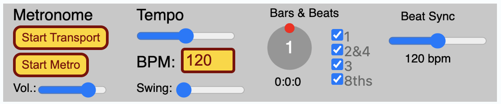
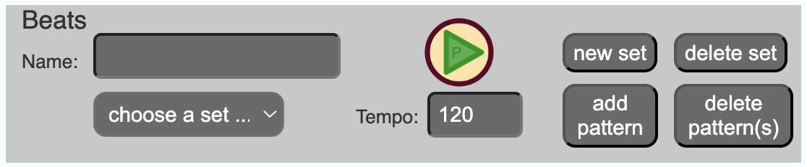
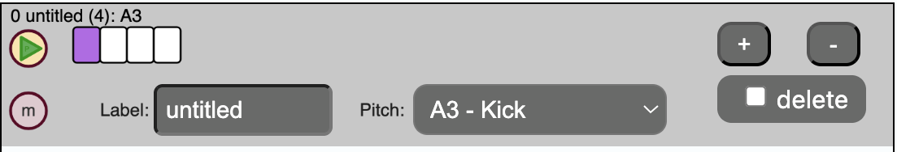
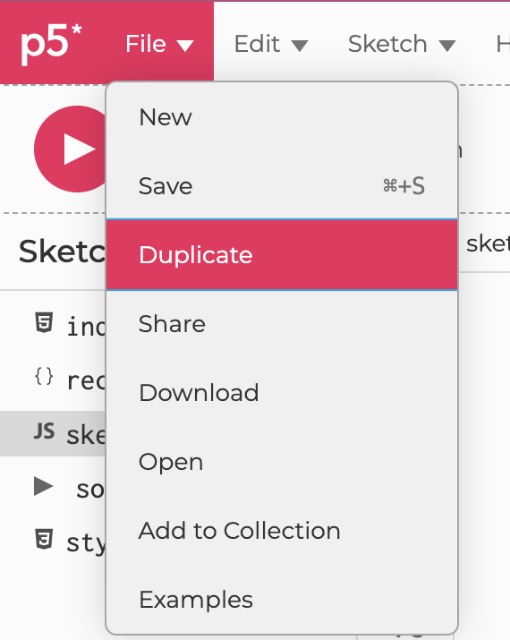
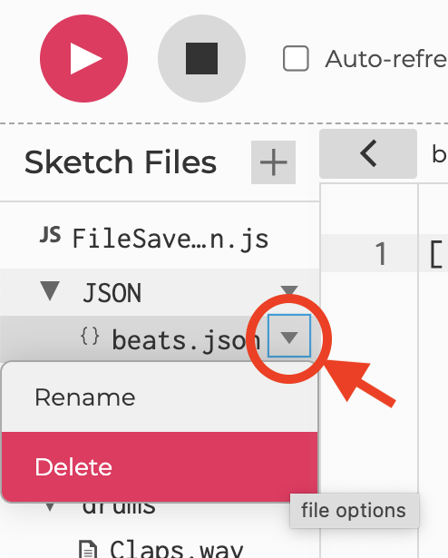
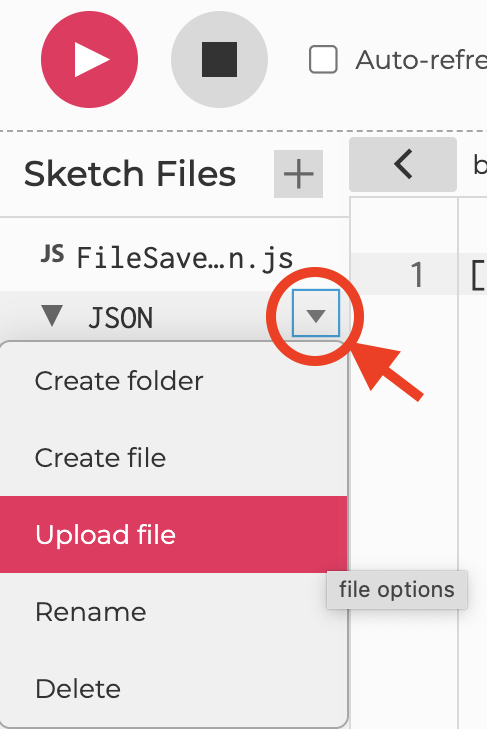

<link href="../../markdown.css" rel="stylesheet"></link> 

# Web App #4 - Beat Patterns
*Design beat patterns for an interactive musical web app*

This project once again will use the P5.js editor (editor.p5js.org). You will need to **log in** to your editor account to complete this project.

## Step 1 - Make Some Beats
Follow this link to get started:

 - <a href="https://editor.p5js.org/dbwetzel/full/pWgjh8bvG" target="_blank">https://editor.p5js.org/dbwetzel/full/pWgjh8bvG</a>

You will see a pattern sequencer interface created in a browser window using P5.js and Tone.js (a musical Web App). This interface was inspired by traditional drum machines, but operates quite differently. In this Web App, you will construct rhythm "sets" made up of one or more "beat patterns." Each pattern is a loop of running sixteenth notes in the prevailing tempo. The individual patterns may be any length, so irregular rhythms are possible. Each pattern is given a fixed "pitch," assigned to a drum sample (kick, snare, claps, etc.). A rhythm set can have any number of patterns. 

At the top of the page is a **metronome** module that controls playback and provides it's own build-in click. Use this to experiment with tempo, listen to different parts of the beat, or synchronize with other players using the same app.<br>


Below that you will see a "Beat Pattern Controller" module that manages your list of rhythm sets. It has features for naming the rhythm set, setting tempo, selecting and loading a set from the list, playing/pausing the rhythm set, adding/deleting a rhythm set, and adding/deleting patterns to/from a set. <br>


### Instructions:
Use the Beat Pattern Designer (beta v. 0.5) to create at least three separate rhythm sets. Each set should have at least two beat patterns. 

1. Click the **"new set"** or **"add pattern"** button to add a new looping pattern to your set (clicking "add pattern" creates a new "untitled" set if no existing set is present or selected).
2. If you didn't already, click **"add pattern"** to add a new default pattern to your set. It will have four 16th-note cells with the first one marked to play. The default sample is a kick drum (pitch: A3). 
3. If you **play the pattern** it will trigger the kick drum every fourth 16th note. This is equivalent to playing on every beat in 4/4 time. You can make the looping pattern longer or shorter using the "+" and "-" buttons.
4. **Click a cell** in the pattern to activate or deactivate it. Shift-click an active cell (purple) to add an accent. An accented note will play louder.
 - Accent patterns can create an additional rhythmic layer to your beat
5. Change the **instrument**, if you like, using the "Pitch" dropdown menu.
6. **Label the pattern** using the "Label" field. This is useful for keeping track of multiple patterns in a complex rhythm set.
7. Add another pattern to the set and assign it to a different instrument. Change the length of the pattern and vary the rhythm it plays back by changing the pattern of active/inactive cells.
 - Multiple patterns will play together as a composite beat.
 - You can also play them individually within a set
8. If you want to delete a pattern, mark it for deletion and then click "delete pattern(s)" in the controller module.
9. **Add two more sets** ("new set") and populate them with at least two rhythm patterns each.
10. Give your sets **unique names** (type in the "Name" field) of the beat controller module.
11. If you want to **delete** a rhythm set, make sure it is selected and then click "delete set." Only the currently selected set is deleted.
12. **Modify the tempo** value for at least one of your three sets. 
 - Do this in the Beat controller module so that it stores this information in your JSON data structure (scroll to the bottom of the Web App page). 
  - Notice that the metronome tempo will change to adapt to the tempo of each of your stored rhythm sets.
 - If you change the tempo in the metronome module, it will only affect playback, not the stored tempo of your rhythm set.

**For each set and pattern** you created, the associated JSON data will update. 

**Go ahead and try out your beats as you work.**

**Note that the pattern can be any length.** Irregular or mismatched patterns can give you interesting and creative results (polyrhythms!). You can add or subtract to patterns and even switch sets while the app is playing.

## Step 2 - Save your Work

1. Download your data from the editor ("Download JSON").
 - This will create a .zip archive called beatLibrary.zip (look for it in your downloads folder).
 - If you are using Safari on a Mac with default settings, this file will probably uncompress for you in the background (skip the next step)
2. Uncompress the .zip archiive
 - Mac: double-click on the file
 - Windows: right-click and choose "Extract All ..." (choose a new location for the extracted archive if you like, or just leave it in your downloads folder)
3. You should now have a folder called "JSON" (or "JSON 2" if you already had a folder by that name)
 - That folder contains a file called "beats.json" -- this is the file to submit as an attachment, and also the one to upload in Step 3.

## Step 3 - Make your own shareable version of the app with your own beat library
1. Follow this link to open the web app again with the source code visible: 
https://editor.p5js.org/dbwetzel/sketches/pWgjh8bvG
2. Log in to the P5.js editor. Make sure you see your own user name in the top right corner ("Hello, <username>!")
3. Duplicate the sketch so you have your own copy in your P5 editor account (File->Duplicate).
Duplicate" width=200>

4. Open the "Sketch Files" pane on the left of the code (">" button)
5. Find the folder "JSON" and delete the current "beats.json" file.


6. Upload your own version of "beats.json" (from your downloads folder, inside the "JSON" folder from Step 2.2 above). Make sure you are uploading it to the JSON folder inside "Sketch Files."


7. **Run your project** ("Play" button on the top left) and check the menu to see if your rhythm sets appear and play back.
 - Yes? Go on to the next step (after testing everything).

If you want to **continue editing** later, you can **upload** a previous "beats.json" file and make changes or additions. If you do so, remember to **download** the new version.

Alternatively, you can "Copy to Clipboard" your entire rhythm library and replace the contents of "beats.json" manually in the editor window. Click on "JSON/beats.json" in the P5 editor's "Sketch files" area to see/edit the contents. Select all, and then paste the contents of the clipboard.

### Example: A basic House beat with an irregular hi-hat pattern:
```javascript
[
{
  "name" : "Basic House"
  "tempo" : 126,
  "beats" : [
    {
      "label" : "kick",
      "pitch" : "A3",
      "pattern" : "1000",
      "accents" : "0000"
    },
    {
      "label" : "claps",
      "pitch" : "C4",
      "pattern" : "0000100000001000",
      "accents" : "0000000000001000"
    },   
    {
      "label" : "hi-hat",
      "pitch" : "F4",
      "pattern" : "00010101110111010100110110010",
      "accents" : "00010000010001000100000100000"
    }
  ]
}
]
```

## Final Step - Submit for credit
1. Add **Attachments**:
 - beats.json

2. Provide a **link** to your editor.p5js.org webb app. 
 - Go to **File->Share** and choose either the "View Only" or "Allow Editing" link. 
 - Click on the link to copy to your clipboard.

*If you have questions or problems, please don't hesitate to reach out by email or ask a question in class!*

