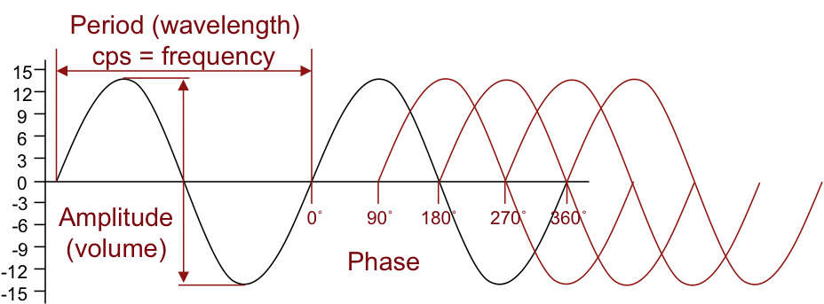

<link href="../../markdown.css" rel="stylesheet"></link> 

[1. The Art and Science of Sound](1.sound.html)

# 1.1.2 Periodic waves

Certain sounds are made up of continuous vibration of air molecules. Our hand clap example could be considered an "impulse" type sound - a sudden "transient" noise with no sustained vibration. It's a momentary spike in air pressure that you perceive as a short, sharp "pop."

A violin, on the other hand, creates sound mainly by drawing a bow across a string. The bow applies friction to the string, causing it to vibrate, or **oscillate**, back and forth rapidly, hundreds of times per second. When it does so, it creates a regular series of pressure waves evenly distributed in time and space. We can measure the frequency of those vibrations, and we perceive that frequency as a pitch. If that violin is playing a note with a frequency of 440 vibrations per second (440 Hertz or Hz), it would match the pitch 'A' above middle 'C' on the piano.

We call a wave that repeats at regular intervals a "periodic" wave because we can graph its pattern of compressions and rarefactions as a regular cycle, or period. The number of cycles per second is its frequency (correlating to our perception of "pitch").

A **cycle** is one complete oscillation of a wave, from equillibrium, to full compession, to full rarefaction, and back to equillibrium. 

The **period** of a wave is the amount of *time* it takes to complete one cycle. Period (cycle duration in milliseconds) and frequency (vibrations per second) are *inversely* related: 
    
**frequency (Hz) = 1 / period (seconds)**

> 50 Hz = 1 / 0.02 seconds (20 ms) 
> 100 Hz = 1 / 0.01 soconds (10 ms) 
> 440 Hz = 1 / 0.0023 seconds (2.3 ms)

**Amplitude** is the height of the wave, representing the amount of displacement in an air pressure wave. We perceive this as loudness.

**Phase** describes the position within a cycle of a wave. We commonly use degrees to describe phase (0 - 360), but some digital systems will normalize it (0 - 1). Phase is important to consider when combining sine tones to make more complex timbres.

**Wavelength** is the physical distance one cycle of a wave would take up in the air. It's the distance between peaks (areas of compression), and it is related to both the frequency and the speed of sound. 

To calculate wavelength, use the formula **λ = v/f**, where λ (lambda) is the wavelength, v is the wave's speed (speed of sound is 343 meters per second or 1125 feet per second), and f is the frequency in Hertz. For that violin note, 'A' @ 440 Hz, we could simply divide 343/440 to get 0.7795 meters (or 1125/440 to get 2.56 feet). 

Wavelength is especially important for acoustical engineering - trying to make a space sound good, based on its shape, dimensions, and resulting resonances. You can use that formula to calculate **room resonances** (possible problem tones that might cause feedback or "boominess" in the sound of a room because they fit evenly in the space and therefore amplify themselves as they reflect off the walls!). For instance, a room with two parallel walls ten feet apart would have a resonance tone (or **"mode"**) at (10 = 1125/f = 112.5 Hz), but the lowest resonance is actually half that frequency, or 56.25 Hz. However, every integer multiple of that lowest frequency (its "harmonics" or "overtones") will also resonate, so your acoustic treatment has to account for frequencies of 56.25 Hz, 112.5 Hz, 168.75 Hz, 225 Hz, 281.25 Hz, 337.5 Hz, 393.75 Hz, and so on. Those bass frequencies are the hardest to treat with acoustical panels, but they are the most important for making sound intelligible in a listening space.

<iframe src="https://editor.p5js.org/dbwetzel/full/wm-u6cvSB" width="400" height="250"></iframe>