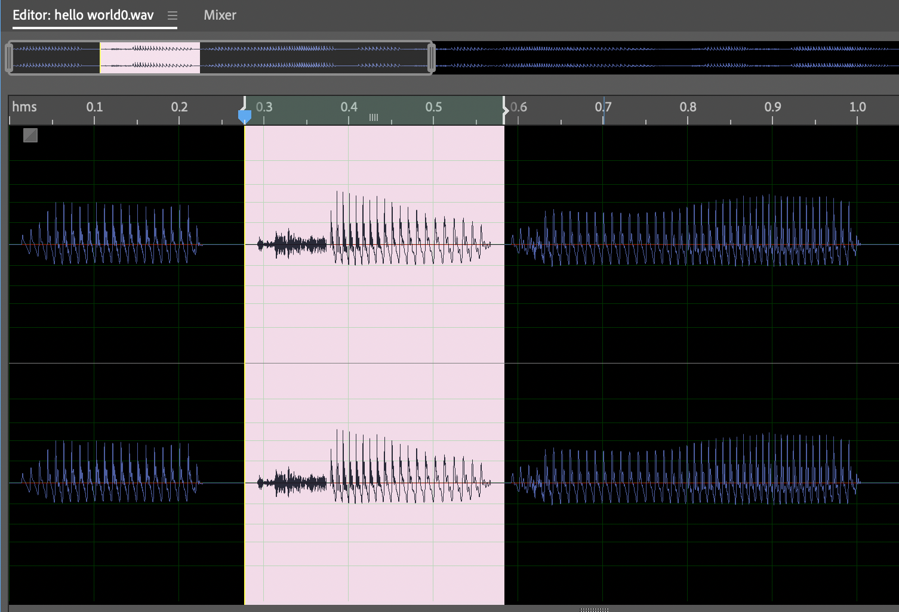

<link href="../../markdown.css" rel="stylesheet"></link> 

[2. Digital Audio](2.audio.html)

# 2.4 Digital Audio Editing
*Sound files as data and sound files as "dependent media"*

Editing digital audio is very unlike editing analog tape. Tape is a fundamentally *linear* medium. Sound is captured as magnetic traces along a thin band corresponding to the acoustic waves transduced into electrical energy. If your tape recorder is running at 15ips, then 15 inches of tape contains exactly one second of sound. To make an edit, you have to cue up the tape to the exact point you want (by ear, because there is no visual representation) and cut it physically with a razor blade. Then find the point you want to join it to, do the same surgery, and then stick the pieces together with adhesive tape. Then play it back to see if you got the edit right.

Digital audio, in any modern system, is contained as a **file** in your computer (or phone, tablet, etc.) operating system. A computer can access this file from any point within the timeline. Because the file is just a stream of numbers, it can be copied, re-ordered, processed, and reassembled infinitely, without the kind of signal degradation you get with analog tape. In a software editing system bits of sound may be isolated, re-arranged, deleted, or transformed, quickly, efficiently, and safely if backup copies of the source file are maintained.

However, there are two modes of editing in a Digital Audio system that you should know about and keep in mind: **destructive** and **non-destructive** editing.

### Destructive editing

Destructive editing fundamentally alters the sample data stored in the file. Deletions, alterations, transformations through signal processing, etc. are all committed to the file as new sample data, overwriting previous samples. This is the process in waveform editing software such as Adobe Audition and the online editor AudioMass. Saving your work overwrites the file in the same way that saving a Word document overwrites whatever you had in the file previously. Standard audio file formats (.wav, .aiff, etc.) have no method for saving backup versions of previous edits, so if you delete something and save the file, the audio you deleted is gone for good!

### Non-destructive editing

Non-destructive editing, as commonly practiced in a Digital Audio Workstation (DAW) application, places *references* to a source audio file on a timeline. Any changes to the sound made on the timeline are merely references to the original source media, which remains unchanged. 

The relationship between the two parts is that of an "edit decision list:" and a set of "dependent media" files. The source audio, in .wav or other common file format sits in a folder on your drive and is never altered by the editor. The seesion file (your multitrack DAW project) probably does not contain any actual audio data, but instead contains a *list* of audio files to play back with information about where to start and stop within the file, how loud to play it, crossfade information, processing, and more. 

However, all these edit decissions are changeable at any time. The original source files are still in their original location, and you can undo any changes. 

**There is one big drawback:** the audio files are stored in a specific location referenced by your DAW session playlist, so if you want to share your session with someone else (a collaborative producer, for instance) then you have to make sure you send all the **dependent media files** along with your session. If you don't, you colleague will get a DAW session with missing audio files and a long list of error messages!