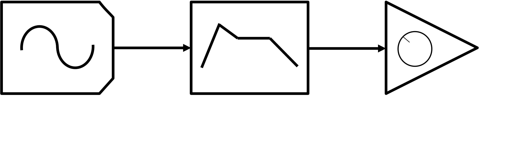
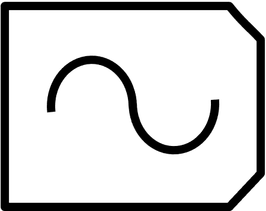
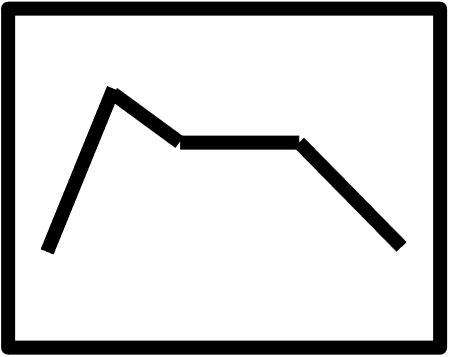
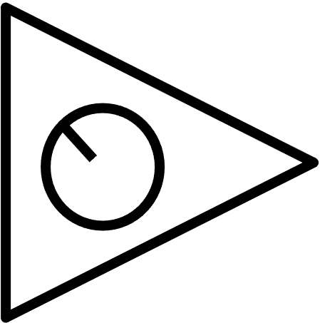
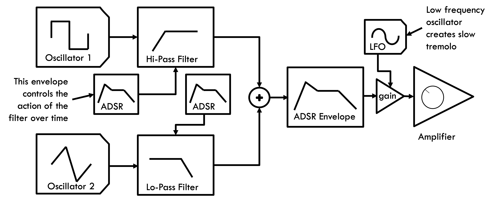

<link href="../../markdown.css" rel="stylesheet"></link> 

[TOC](../../toc.html) / [3. Synthesis](3.Synthesis.html)

# 3.1 Synthesis Theory

*Algorithms, architecture, and parameters*

| Component | Function |
| --- | --- |
|Oscillator   |  Generates a basic tone or sound:   - Sine/Triangle/Sawtooth/Square wave   - Noise or other complex wave shape   - Sampled sound |
| Envelope Generator | Controls the attack and release of a note (amplitude over time) Attack (A) – the speed of the attack (~0 to 250 msec)  Decay (D) – time after attack to settle to sustain volume  Sustain (S) – volume level to hold at while key is pressed  Release (R) – Time it takes to fade to silence after key is released | 
| Amplifier  | Controls the overall volume of the sound going to the speakers |

## Common synthesizer algorithm types

* Additive – combines banks of simple oscillators to generate complex timbres
* Subtractive – filters complex tones to create rich timbres
* Frequency Modulation (FM) – oscillator frequency modulated by a second oscillator to create complex timbres
* Sampler – recorded sound is modified with filters and envelope generators
* Physical modeling – algorithms mimic the operation of physical instruments (buzz + filter)

Next:
* 3.2 [Synthesizer History](3.2.synth-history.html)
* 3.3 [Listening for Synths in Music](3.3.synth-listening.html)
* 3.4 [Create and edit a synth patch](3.4.synth-editing.html)