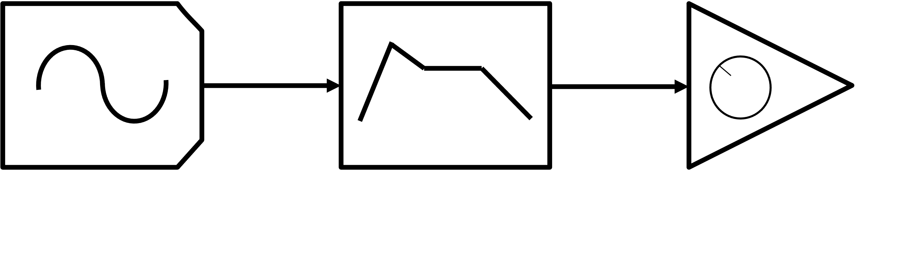
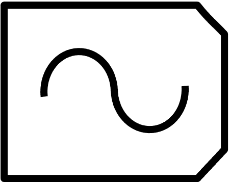
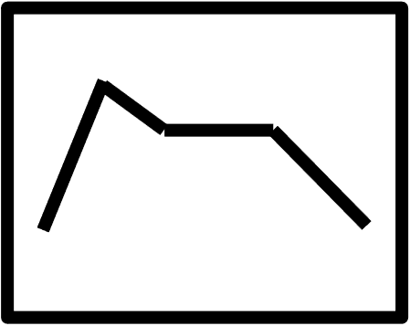
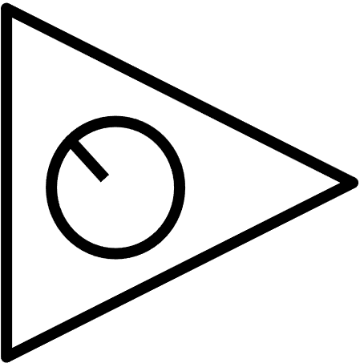
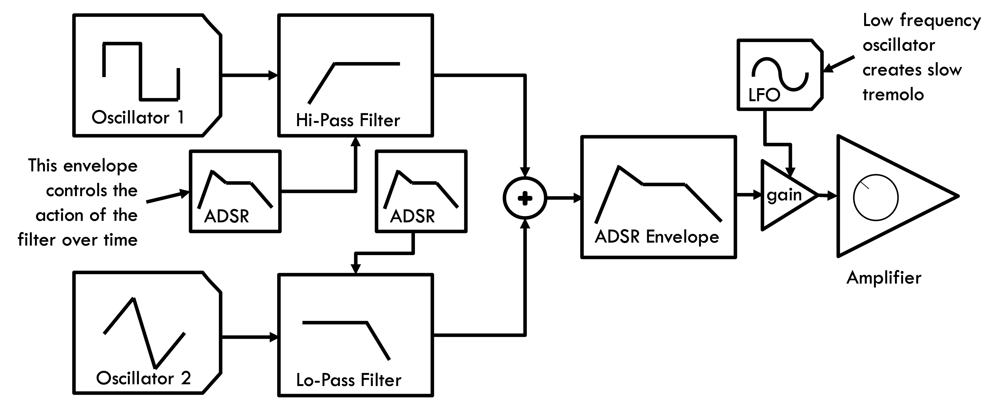

<link href="../../markdown.css" rel="stylesheet"></link> 

[TOC](../../toc.html) / [3. Synthesis](3.Synthesis.html)

# 3.1 Synthesis Theory

*Algorithms, architecture, and parameters*

## What is a synthesizer?
* A machine that generates sound electronically, often digitally.
* Synthesizers may be stand-alone devices (keyboards, rack-mounted, sound modules, etc.)
* “Virtual Instruments” are synthesizers that exist as software (stand-alone or as a "plugin" to other software)

## How do they work?
Most synthesizers, at their most basic level, share a common structure. There is a sound generating source, usually some kind of oscillator, an amplitude "envelope" controller that defines and articulates an individual note, and a final volume control.

| Component | Function |
| --- | --- |
|Oscillator   |  Generates a basic tone or sound:   - Sine/Triangle/Sawtooth/Square wave   - Noise or other complex wave shape   - Sampled sound |
| Envelope Generator | Controls the attack and release of a note (amplitude over time) Attack (A) – the speed of the attack (~0 to 250 msec)  Decay (D) – time after attack to settle to sustain volume  Sustain (S) – volume level to hold at while key is pressed  Release (R) – Time it takes to fade to silence after key is released | 
| Amplifier  | Controls the overall volume of the sound going to the speakers |

Beyond this basic architecture, synthesizers can become much more complex, adding filters, LFO controls, parallel algorithms, and innovative strategies for sound generation.

## Common synthesizer algorithm types

* Additive – combines banks of simple oscillators to generate complex timbres
* Subtractive – filters complex tones to create rich timbres
* Frequency Modulation (FM) – oscillator frequency modulated by a second oscillator to create complex timbres
* Sampler – recorded sound is modified with filters and envelope generators
* Physical modeling – algorithms mimic the operation of physical instruments (buzz + filter)

Skip to:
* 3.1 [Synthesizer Theory](3.1.synth-theory.html)
* 3.2 [Synthesizer History](3.2.synth-history.html)
* 3.3 [Listening for Synths in Music](3.3.synth-listening.html)
* 3.4 [Create and edit a synth patch](3.4.synth-edit.html)